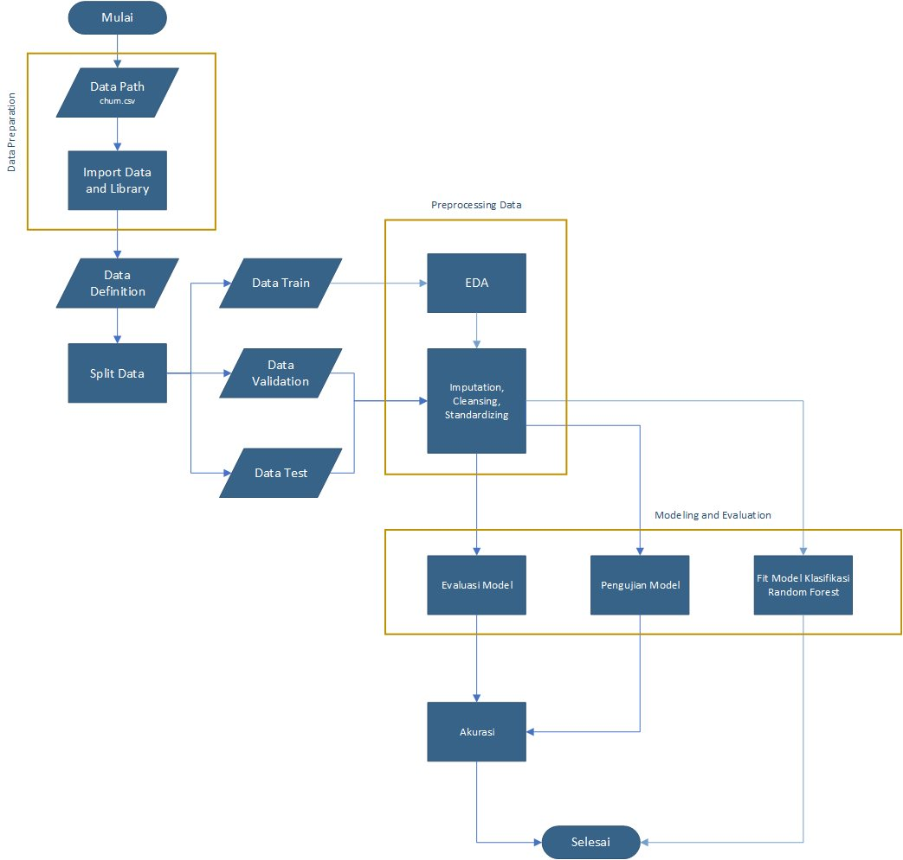
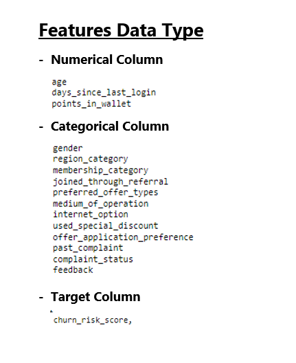
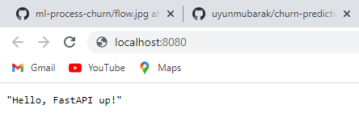
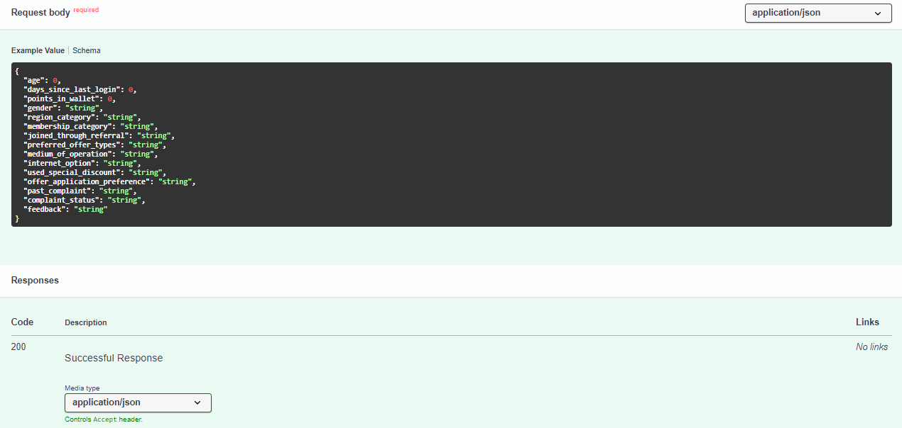
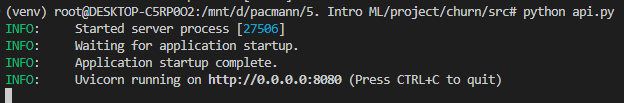
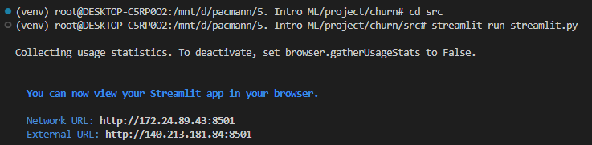
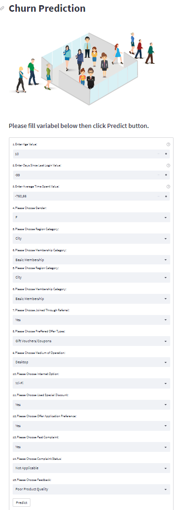

# Implementasi Metode Random Forest Pada Prediksi Customer Churn
---
### -  Background & Objectives
Banyaknya persaingan antar perusahaan menjadi tantangan tersendiri bagi perusahaan. Perlu adanya strategi khusus untuk tetap bertahan dan tidak kalah saing dengan perusahan lainnya. Ada beberapa faktor yang dapat meningkatkan jumlah produk, salah satunya yaitu pelanggan. Dengan melakukan prediksi pelanggan, perusahaan dapat mengetahui tingkat loyalitas dari seorang pelanggan. Hal ini dapat membantu perusahaan dalam mengambil keputusan atau tindakan ketika adanya pelanggan yang terdeteksi churn.

Pada project ini dibangun sebuah model prediksi menggunakan metode random forest untuk dapat melakukan prediksi dimana outputnya berupa 0 (no churn) dan 1 (churn).

### - Project Architecture
Project architecture dari project ini, dapat dilihat pada gambar berikut.

### - Feature Data Type
Untuk tipe data dari keseluruhan fitur, dapat dilihat pada gambar berikut.

### - Format Message untuk melakukan prediksi via API

### -Format Message response dari API

### Cara menjalankan layanan machine learning di komputer
- Running API

- Running Streamlit

- Tampilan Streamlit
